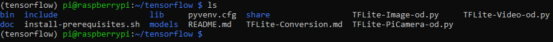
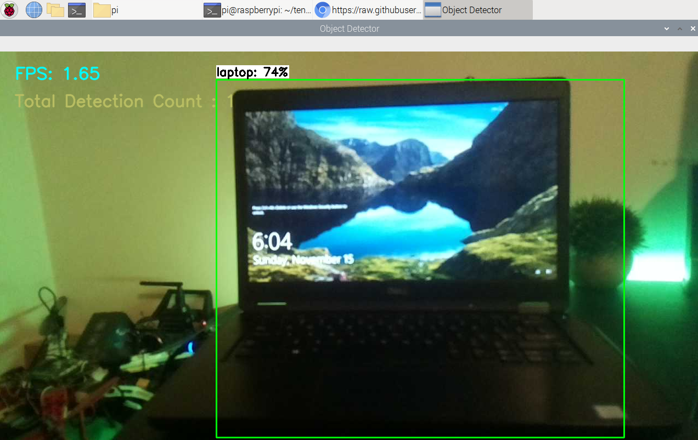

# TensorFlow-2-Lite-Object-Detection-on-the-Raspberry-Pi
[](https://github.com/tensorflow/tensorflow/releases/tag/v2.2.0)
### Learn how to Convert and Run TensorFlow Lite Object Detection Models on the Raspberry Pi
<p align="center">
  
</p>

## Introduction
This repository is a written tutorial covering two topics. TensorFlow Lite conversion and running on the Raspberry Pi. This document contains instructions for running on the Raspberry Pi. If you want to convert a Custom TensorFlow 2 Object Detection Model, please refer to the [conversion guide](https://github.com/armaanpriyadarshan/TensorFlow-2-Lite-Object-Detection-on-the-Raspberry-Pi/blob/main/TFLite-Conversion.md). These instructions are likely to change often with time, so if you have questions feel free to raise an issue. ***This guide has last been tested and updated on 11/13/2020.***

**I will soon make a YouTube Tutorial which will be posted [here](https://www.youtube.com/watch?v=2ofuUdCDppc), and an extremely import step [here](https://www.youtube.com/channel/UCT9t2Bug62RDUfSBcPt0Bzg?sub_confirmation=1)!**

## Why TensorFlow Lite?
This guide is my 3rd in a series about the TensorFlow Object Detection API. Of my 2 previous guides, one of them is about TensorFlow Object Detection on the Raspberry Pi. If I already have a tutorial, why make another? TensorFlow Lite is a massive improvement from your standard TensorFlow installation. Not only is it so much easier to install and use, but the performance is significantly better. It's optimized to run on mobile and other edge devices such as the Raspberry Pi. The numbers speak for themselves!
<p align="left">
  
</p>

**It took over 3 minutes to load a TensorFlow model and less than a second to load TensorFlow Lite model. TensorFlow Lite loaded literally 5,693,400% faster(yes I did the math).**

## Table of Contents
1. [Setting up the Raspberry Pi and Getting Updates](https://github.com/armaanpriyadarshan/TensorFlow-2-Lite-Object-Detection-on-the-Raspberry-Pi/blob/main/README.md#step-1-setting-up-the-raspberry-pi-and-getting-updates)
2. [Organizing our Workspace and Virtual Environment](https://github.com/armaanpriyadarshan/TensorFlow-2-Lite-Object-Detection-on-the-Raspberry-Pi/blob/main/README.md#step-2-organizing-our-workspace-and-virtual-environment)
3. [Installing the Prerequisites](https://github.com/armaanpriyadarshan/TensorFlow-2-Lite-Object-Detection-on-the-Raspberry-Pi#step-3-installing-the-prerequisites)
4. [Running Object Detection on Image, Video, or Pi Camera](https://github.com/armaanpriyadarshan/TensorFlow-2-Lite-Object-Detection-on-the-Raspberry-Pi/blob/main/README.md#step-4-running-object-detection-on-image-video-or-pi-camera)

## Step 1: Setting up the Raspberry Pi and Getting Updates
Before we can get started, we must have access to the Raspberry Pi's Desktop Interface. This can be done with VNC Viewer or the standard Monitor and HDMI. I made a more detailed video which can be found below

[](https://www.youtube.com/watch?v=jVzMRlCNO3U)

Once you have access to the Desktop Interface, either remote or physical, open up a terminal. Retrieve updates for the Raspberry Pi with

```
sudo apt-get update
sudo apt-get dist-upgrade
```

Depending on how recently you setup or updated your Pi, this can be instantaneous or lengthy. After your Raspberry Pi is up-to-date, we should make sure our Camera is enabled. First to open up the System Interface, use

```
sudo raspi-config
```

Then navigate to Interfacing Options -> Camera and make sure it is enabled. Then hit Finish and reboot if necessary.

<p align="left">
  
</p>

## Step 2: Organizing our Workspace and Virtual Environment

Then, your going to want to clone this repository with

```
git clone https://github.com/armaanpriyadarshan/TensorFlow-2-Lite-Object-Detection-on-the-Raspberry-Pi.git
```

This name is a bit long so let's trim it down with

```
mv TensorFlow-2-Lite-Object-Detection-on-the-Raspberry-Pi tensorflow
```

We are now going to create a Virtual Environment to avoid version conflicts with previously installed packages on the Raspberry Pi. First, let's install virtual env with

```
sudo pip3 install virtualenv
```

Now, we can create our ```tensorflow``` virtual environment with

```
python3 -m venv tensorflow
```

There should now be a ```bin``` folder inside of our ```tensorflow``` directory. So let's change directories with

```
cd tensorflow
```

We can then activate our Virtual Envvironment with

```
source bin/activate
```

**Note: Now that we have a virtual environment, everytime you start a new terminal, you will no longer be in the virtual environment. You can reactivate it manually or issue ```echo "source tensorflow/bin/activate" >> ~/.bashrc```. This basically activates our Virtual Environment as soon as we open a new terminal. You can tell if the Virtual Environment is active by the name showing up in parenthesis next to the working directory.**

When you issue ```ls```, your ```tensorflow``` directory should now look something like this

<p align="left">
  
</p>

## Step 3: Installing the Prerequisites
This step should be relatively simple. I have compressed all the commands into one shellscript which you can run with
```
bash install-prerequisites.sh
```
This might take a few minutes, but after everything has been installed you should get this message
```
Prerequisites Installed Successfully
```
Now, it's best to test our installation of the tflite_runtime module. To do this first type
```
python
```
From the Python terminal, enter these lines
```
Python 3.7.3 (default, Jul 25 2020, 13:03:44)
[GCC 8.3.0] on linux
Type "help", "copyright", "credits" or "license" for more information.
>>> import tflite_runtime as tf
>>> print(tf.__version__)
```
If everything went according to plan, you should get 
```
2.5.0
```
**Note: The link for downloading the tflite_runtime module is bound to change based on your Python version and platform/architecture. With time, newer versions will be also be released. I'll try my best to update this guide frequently, but the most recent instructions for the installation are located [here](https://www.tensorflow.org/lite/guide/python)**

## Step 4: Running Object Detection on Image, Video, or Pi Camera
Now we're finally ready to run object detection! In this repository, I've included a sample model that I converted as well as 3 object detection scripts utilizing OpenCV. If you want to convert a custom model or a pre-trained model, you can look at the [TensorFlow Lite Conversion Guide](https://github.com/armaanpriyadarshan/TensorFlow-2-Lite-Object-Detection-on-the-Raspberry-Pi/blob/main/TFLite-Conversion.md) that I wrote. A majority of the code is from [Edje Electronics' tutorial](https://github.com/EdjeElectronics/TensorFlow-Lite-Object-Detection-on-Android-and-Raspberry-Pi) with a few small adjustments. 
- ```TFLite-PiCamera-od.py```: This program uses the Pi Camera to perform object detection. It also counts and displays the number of objects detected in the frame. The usage is
```
usage: TFLite-PiCamera-od.py [-h] [--model MODEL] [--labels LABELS]
                             [--threshold THRESHOLD] [--resolution RESOLUTION]

optional arguments:
  -h, --help            show this help message and exit
  --model MODEL         Provide the path to the TFLite file, default is
                        models/model.tflite
  --labels LABELS       Provide the path to the Labels, default is
                        models/labels.txt
  --threshold THRESHOLD
                        Minimum confidence threshold for displaying detected
                        objects
  --resolution RESOLUTION
                        Desired webcam resolution in WxH. If the webcam does
                        not support the resolution entered, errors may occur.
```
- ```TFLite-Image-od.py```: This program takes a single image as input. I haven't managed to get it to run inference on a directory yet. If you do, feel free to share it as it might help others. This script also counts the number of detections. The usage is
```
usage: TFLite-Image-od.py [-h] [--model MODEL] [--labels LABELS]
                          [--image IMAGE] [--threshold THRESHOLD]
                          [--resolution RESOLUTION]

optional arguments:
  -h, --help            show this help message and exit
  --model MODEL         Provide the path to the TFLite file, default is
                        models/model.tflite
  --labels LABELS       Provide the path to the Labels, default is
                        models/labels.txt
  --image IMAGE         Name of the single image to perform detection on
  --threshold THRESHOLD
                        Minimum confidence threshold for displaying detected
                        objects
  --resolution RESOLUTION
                        Desired webcam resolution in WxH. If the webcam does
                        not support the resolution entered, errors may occur.
 ```
- ```TFLite-Video-od.py```: This program is similar to the last two however it takes a video as input. The usage is
```
usage: TFLite-Video-od.py [-h] [--model MODEL] [--labels LABELS]
                          [--video VIDEO] [--threshold THRESHOLD]
                          [--resolution RESOLUTION]

optional arguments:
  -h, --help            show this help message and exit
  --model MODEL         Provide the path to the TFLite file, default is
                        models/model.tflite
  --labels LABELS       Provide the path to the Labels, default is
                        models/labels.txt
  --video VIDEO         Name of the video to perform detection on
  --threshold THRESHOLD
                        Minimum confidence threshold for displaying detected
                        objects
  --resolution RESOLUTION
                        Desired webcam resolution in WxH. If the webcam does
                        not support the resolution entered, errors may occur.
 ```
 
 Now to finally test it out, run
 ```
 python TFLite-PiCamera-od.py
 ```
 If everything works you should get something like this
 <p align="left">
  
</p>

Congratulations! This means we're successfully performing real-time object detection on the Raspberry Pi! Now that you've tried out the Pi Camera, why not one of the other scripts? Over the next weeks I'll continue to add on to this repo and tinker with the programs to make them better than ever! If you find something cool, feel free to share it, as others can also learn! And if you have any errors, just raise an issue and I'll be happy to take a look at it. Great work, and until next time, bye! 
