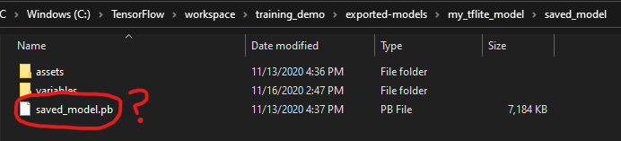
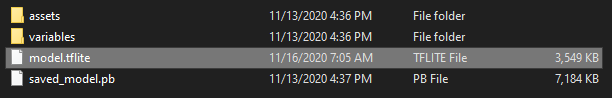
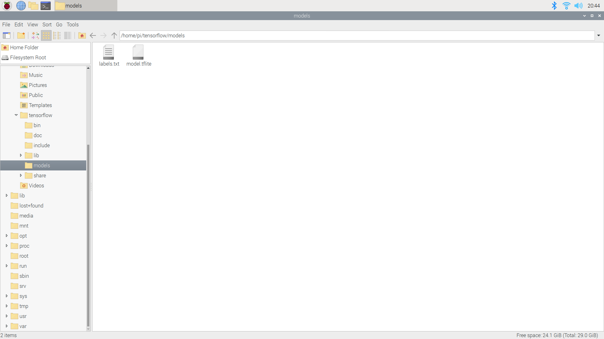

# Converting TensorFlow Models to TensorFlow Lite
[](https://github.com/tensorflow/tensorflow/releases/tag/v2.2.0)
### This Guide Contains Everything you Need to Convert Custom and Pre-trained TensorFlow Models to TensorFlow Lite
Following these intstructions, you can convert either a custom model or convert a pre-trained TensorFlow model. If you want to train a custom TensorFlow object detection model, I've made a detailed [GitHub guide](https://github.com/armaanpriyadarshan/Training-a-Custom-TensorFlow-2.X-Object-Detector) and a YouTube video on the topic.

[](https://www.youtube.com/watch?v=oqd54apcgGE)

**The following steps for conversion are based off of the directory structure and procedures in this guide. So if you haven't already taken a look at it, I recommend you do so.
To move on, you should have already**
  - **Installed Anaconda**
  - **Setup the Directory Structure**
  - **Compiled Protos and Setup the TensorFlow Object Detection API**
  - **Gathered Training Data**
  - **Trained your Model (without exporting)**
  
## Steps
1. [Exporting the Model](https://github.com/armaanpriyadarshan/TensorFlow-2-Lite-Object-Detection-on-the-Raspberry-Pi/blob/main/TFLite-Conversion.md#exporting-the-model) 
2. [Creating a New Environment and Installing TensorFlow Nightly](https://github.com/armaanpriyadarshan/TensorFlow-2-Lite-Object-Detection-on-the-Raspberry-Pi/blob/main/TFLite-Conversion.md#creating-a-new-environment-and-installing-tensorflow-nightly)
3. [Converting the Model to TensorFlow Lite](https://github.com/armaanpriyadarshan/TensorFlow-2-Lite-Object-Detection-on-the-Raspberry-Pi/blob/main/TFLite-Conversion.md#converting-the-model-to-tensorflow-lite)
4. [Preparing our Model for Use](https://github.com/armaanpriyadarshan/TensorFlow-2-Lite-Object-Detection-on-the-Raspberry-Pi/blob/main/TFLite-Conversion.md#preparing-our-model-for-use)
 
### Exporting the Model
Assuming you followed my previous guide, your directory structure should look something like this
<p align="left">
  
</p>

If you haven't already, make sure you have already configured the training pipeline and trained the model. You should now have a training directory (if you followed my other guide, this is ```models\my_ssd_mobilenet_v2_fpnlite```) and a ```pipeline.config``` file (```models\my_ssd_mobilenet_v2_fpnlite\pipeline.config```). Open up a new Anaconda terminal and activate the virtual environment we made in the other tutorial with

```
conda activate tensorflow
```
Now, we can change directories with

```
cd C:\TensorFlow\workspace\training_demo
```
Now, unlike my other guide, we aren't using ```exporter_main_v2.py``` to export the model. For TensorFlow Lite Models, we have to use ```export_tflite_graph_tf2.py```. You can export the model with
```
python export_tflite_graph_tf2.py --pipeline_config_path models\my_ssd_mobilenet_v2_fpnlite\pipeline.config --trained_checkpoint_dir models\my_ssd_mobilenet_v2_fpnlite --output_directory exported-models\my_tflite_model
```
**Note: At the moment, TensorFlow Lite only support models with the SSD Architecture (excluding EfficientDet). Make sure that you have trained with an SSD training pipeline before you continue. You can take a look at the [TensorFlow Model Zoo](https://github.com/tensorflow/models/blob/master/research/object_detection/g3doc/tf2_detection_zoo.md) or the [documentation](https://github.com/tensorflow/models/blob/master/research/object_detection/g3doc/running_on_mobile_tf2.md) for the most up-to-date information.**

### Creating a New Environment and Installing TensorFlow Nightly
To avoid version conflicts, we'll first create a new Anaconda virtual environment to hold all the packages necessary for conversion. First, we must deactivate our current environment with

```
conda deactivate
```

Now issue this command to create a new environment for TFLite conversion.

```
conda create -n tflite pip python=3.7
```

We can now activate our environment with

```
conda activate tflite
```

**Note that whenever you open a new Anaconda Terminal you will not be in the virtual environment. So if you open a new prompt make sure to use the command above to activate the virtual environment**

Now we must install TensorFlow in this virtual environment. However, in this environment we will not just be installing standard TensorFlow. We are going to install tf-nightly. This package is a nightly updated build of TensorFlow. This means it contains the very latest features that TensorFlow has to offer. There is a CPU and GPU version, but if you are only using it conversion I'd stick to the CPU version because it doesn't really matter. We can install it by issuing

```
pip install tf-nightly
```
Now, to test our installation let's use a Python terminal.
```
python
```
Then import the module with
```
Python 3.7.9 (default, Aug 31 2020, 17:10:11) [MSC v.1916 64 bit (AMD64)] :: Anaconda, Inc. on win32
Type "help", "copyright", "credits" or "license" for more information.
>>> import tensorflow as tf
>>> print(tf.__version)
```

**Note: You might get an error with importing the newest version of Numpy. It looks something like this ```RuntimeError: The current Numpy installation ('D:\\Apps\\anaconda3\\envs\\tflite\\lib\\site-packages\\numpy\\__init__.py') fails to pass a sanity check due to a bug in the windows runtime. See this issue for more information: https://tinyurl.com/y3dm3h86```. You can fix this error by installing a previous version of Numpy with ```pip install numpy==1.19.3```.**

If the installation was successful, you should get the version of tf-nightly that you installed. 
```
2.5.0-dev20201111
```

### Converting the Model to TensorFlow Lite
Now, you might have a question or two. If the program is called ```export_tflite_graph_tf2.py```, why is the exported inference graph a ```saved_model.pb``` file? Isn't this the same as standard TensorFlow?
<p align="left">
  
</p>

Well, in this step we'll be converting the ```saved_model``` to a single ```model.tflite``` file for object detection with tf-nightly. I recently added a sample converter program to my other repository called ```convert-to-tflite.py```. This script takes a saved_model folder for input and then converts the model to the .tflite format. Additionally, it also quantizes the model. If you take a look at the code, there are also various different features and options commented. These are optional and might be a little buggy. For some more information, take a look at the [TensorFlow Lite converter](https://www.tensorflow.org/lite/convert/). The usage of this program is as so

```
usage: convert-to-tflite.py [-h] [--model MODEL] [--output OUTPUT]

optional arguments:
  -h, --help       show this help message and exit
  --model MODEL    Folder that the saved model is located in
  --output OUTPUT  Folder that the tflite model will be written to
```

At the moment I'd recommend not using the output argument and sticking to the default values as it still has a few errors. Enough talking, to convert the model run
```
python convert-to-tflite.py
```

You should now see a file in the ```exported-models\my_tflite_model\saved_model``` directory called ```model.tflite```

<p align="left">
  
</p>

Now, there is something very important to note with this file. Take a look at the file size of the ```model.tflite``` file. **If your file size is 1 KB, that means something has gone wrong with conversion**. If you were to run object detection with this model, you will get various errors. As you can see in the image, my model is 3,549 KB which is an appropriate size. If your file is significantly bigger, 121,000 KB for example, it will drastically impact performance while running. With a model that big, my framerates dropped all the way down to 0.07 FPS. If you have any questions about this, feel free to raise an issue and I will try my best to help you out. 

### Preparing our Model for Use
Now that we have our model, it's time to create a new labelmap. Unlike standard TensorFlow, TensorFlow uses a .txt file instead of a .pbtxt file. Creating a new labelmap is actually much easier than it sounds. Let's take a look at an example. Below, I have provided the ```label_map.pbtxt``` that I used for my Pill Detection model.
```
item {
    id: 1
    name: 'Acetaminophen 325 MG Oral Tablet'
}

item {
    id: 2
    name: 'Ibuprofen 200 MG Oral Tablet'
}
```
If we were to create a new labelmap for TensorFlow Lite, all we have to do is write each of the item names on it's own line like so
```
Acetaminophen 325 MG Oral Tablet
Ibuprofen 200 MG Oral Tablet
```
Once you are finished filling it out save the file within the ```exported-models\my_tflite_model\saved_model``` as ```labels.txt```. The directory should now look like this

<p align="left">
  
</p>

We're done! The model is now ready to be used. If you want to run on the Raspberry Pi, you can transfer the model any way you prefer. [WinSCP](https://winscp.net/eng/index.php), an SFTP client, is my favorite method. Place the ```model.tflite``` file and the ```labels.txt``` in the ```tensorflow/models``` directory on the Raspberry Pi. Once your done, it should look like this

<p align="left">
  
</p>

There you go, you're all set to run object detection on the Pi! Good Luck!
